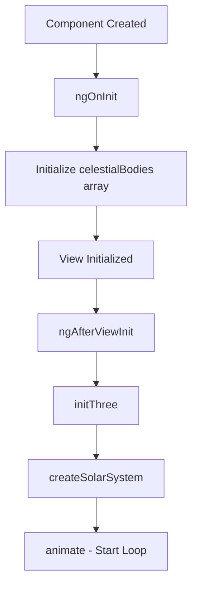
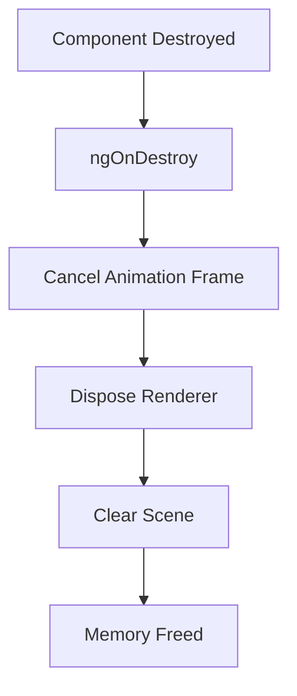

# Solar System Application - Component Reference

## Table of Contents

1. [Component Architecture](#component-architecture)
2. [AppComponent](#appcomponent)
3. [SolarSystemComponent](#solarsystemcomponent)
4. [Component Lifecycle](#component-lifecycle)
5. [Data Flow](#data-flow)
6. [Event Handling](#event-handling)
7. [Styling Architecture](#styling-architecture)
8. [Best Practices](#best-practices)

## Component Architecture

The Solar System application follows a simple but effective component architecture:

```
AppComponent (Root)
└── SolarSystemComponent (Main Feature)
    ├── Three.js Scene Management
    ├── Animation Loop
    ├── User Controls
    └── Asset Loading
```

### Design Patterns Used

- **Container-Presentation Pattern**: `SolarSystemComponent` acts as both container and presentation
- **Lifecycle Management**: Proper initialization and cleanup using Angular lifecycle hooks
- **Encapsulation**: Private methods for internal Three.js operations
- **Reactive Updates**: Two-way data binding for simulation speed control

## AppComponent

### Component Overview

The root component that bootstraps the entire application.

```typescript
@Component({
  selector: 'app-root',
  templateUrl: './app.component.html',
  styleUrls: ['./app.component.scss']
})
export class AppComponent {
  title = 'solar-system';
}
```

### Responsibilities

- **Application Bootstrap**: Entry point for the Angular application
- **Layout Container**: Provides the basic structure for the app
- **Child Component Host**: Hosts the main `SolarSystemComponent`

### Template Structure

```html
<app-solar-system></app-solar-system>
```

**Simple and Clean**: The template is minimal, delegating all functionality to the child component.

### Styling

The component uses default Angular styling with no custom styles applied.

### Usage Context

- Automatically instantiated by Angular when the application starts
- Cannot be used as a reusable component (it's the root)
- Provides the foundation for the entire application

## SolarSystemComponent

### Component Overview

The main feature component that creates and manages the 3D solar system visualization.

```typescript
@Component({
  selector: 'app-solar-system',
  templateUrl: './solar-system.component.html',
  styleUrls: ['./solar-system.component.scss']
})
export class SolarSystemComponent implements OnInit, AfterViewInit, OnDestroy
```

### Key Features

- **3D Scene Management**: Creates and manages Three.js scene, camera, and renderer
- **Asset Loading**: Handles texture loading with fallback mechanisms
- **Animation Control**: Manages the main animation loop and speed control
- **User Interaction**: Provides orbit controls for scene navigation
- **Memory Management**: Proper cleanup to prevent memory leaks

### Properties

#### Public Properties

```typescript
public simulationSpeed: number = 1;
```

- **Type**: `number`
- **Default**: `1`
- **Range**: `0.1` to `5.0`
- **Purpose**: Controls the speed multiplier for all animations
- **Binding**: Two-way bound to the speed control slider

#### Private Properties

```typescript
@ViewChild('rendererContainer') rendererContainer!: ElementRef;
private renderer!: THREE.WebGLRenderer;
private scene!: THREE.Scene;
private camera!: THREE.PerspectiveCamera;
private controls!: OrbitControls;
private animationFrameId!: number;
private celestialBodies: CelestialBody[] = [];
```

| Property | Type | Purpose |
|----------|------|---------|
| `rendererContainer` | `ElementRef` | DOM reference for Three.js canvas |
| `renderer` | `THREE.WebGLRenderer` | WebGL renderer instance |
| `scene` | `THREE.Scene` | Three.js scene container |
| `camera` | `THREE.PerspectiveCamera` | Camera for viewing the scene |
| `controls` | `OrbitControls` | User interaction controls |
| `animationFrameId` | `number` | ID for animation frame management |
| `celestialBodies` | `CelestialBody[]` | Configuration data for all planets |

### Methods

#### Lifecycle Methods

```typescript
ngOnInit(): void
```
- **Purpose**: Initializes the celestial bodies configuration
- **Timing**: Called once after component creation
- **Operations**: Populates the `celestialBodies` array with planet data

```typescript
ngAfterViewInit(): void
```
- **Purpose**: Initializes Three.js and starts the animation
- **Timing**: Called after view initialization
- **Operations**: 
  - Calls `initThree()`
  - Calls `createSolarSystem()`
  - Starts the animation loop

```typescript
ngOnDestroy(): void
```
- **Purpose**: Cleanup to prevent memory leaks
- **Timing**: Called when component is destroyed
- **Operations**:
  - Cancels animation frame
  - Disposes of Three.js resources
  - Clears the scene

#### Core Methods

```typescript
private initThree(): void
```
**Purpose**: Sets up the Three.js environment

**Operations**:
- Creates scene with black background
- Configures perspective camera
- Sets up WebGL renderer with antialiasing
- Adds orbit controls with damping
- Sets up lighting system (4 different light types)
- Adds star field background
- Attaches window resize handler

**Lighting Configuration**:
```typescript
// Ambient light for general illumination
const ambientLight = new THREE.AmbientLight(0xffffff, 0.5);

// Point light from the sun
const sunLight = new THREE.PointLight(0xffffff, 2, 500);

// Directional light for better visibility
const directionalLight = new THREE.DirectionalLight(0xffffff, 0.8);

// Hemisphere light for ambient reflections
const hemisphereLight = new THREE.HemisphereLight(0xffffbb, 0x080820, 0.5);
```

```typescript
private createSolarSystem(): void
```
**Purpose**: Creates all celestial bodies and their components

**Operations**:
- Iterates through `celestialBodies` array
- Creates sphere geometry for each planet
- Loads textures with fallback to colors
- Positions planets at correct distances
- Creates orbital paths
- Adds rings for applicable planets (Saturn)
- Creates moon systems for planets that have them

**Texture Loading Strategy**:
```typescript
const texture = textureLoader.load(
  body.texture,
  // Success callback
  (loadedTexture) => { /* Update material */ },
  // Progress callback
  undefined,
  // Error callback  
  (error) => { /* Use fallback color */ }
);
```

```typescript
private animate(): void
```
**Purpose**: Main animation loop using `requestAnimationFrame`

**Operations**:
- Updates planet rotations based on `rotationSpeed` and `simulationSpeed`
- Updates orbital positions using trigonometric calculations
- Updates moon orbits and rotations
- Updates orbit controls
- Renders the scene
- Schedules next animation frame

**Animation Calculations**:
```typescript
// Orbital movement
const time = Date.now() * 0.001 * this.simulationSpeed;
body.object.position.x = Math.cos(time * body.orbitalSpeed) * body.distance;
body.object.position.z = Math.sin(time * body.orbitalSpeed) * body.distance;

// Rotation
body.object.rotation.y += body.rotationSpeed * this.simulationSpeed;
```

#### Utility Methods

```typescript
private addStars(): void
```
- Creates 10,000 random star points
- Uses `THREE.Points` for efficient rendering
- Distributes stars in a 2000x2000x2000 unit cube

```typescript
private createRings(planet: CelestialBody): void
```
- Creates ring geometry using `THREE.RingGeometry`
- Applies textures for Saturn's rings
- Handles transparency and double-sided rendering

```typescript
private createMoons(planet: CelestialBody): void
```
- Creates moon geometry and materials
- Uses pivot objects for orbital mechanics
- Loads specific textures for Earth's moon

```typescript
private onWindowResize(): void
```
- Updates camera aspect ratio
- Resizes renderer to match window
- Maintains proper perspective

### Template Structure

```html
<div class="solar-system-container">
  <div #rendererContainer class="renderer-container"></div>
  
  <div class="controls-container">
    <div class="speed-control">
      <label for="speed-slider">Velocidad: {{simulationSpeed.toFixed(1)}}x</label>
      <input 
        id="speed-slider" 
        type="range" 
        min="0.1" 
        max="5" 
        step="0.1" 
        [(ngModel)]="simulationSpeed" 
        class="slider"
      >
    </div>
  </div>
</div>
```

#### Template Features

- **Renderer Container**: DOM element where Three.js canvas is attached
- **Controls Container**: Fixed position overlay with simulation controls
- **Speed Control**: Range slider with two-way data binding
- **Real-time Display**: Shows current speed value with one decimal place

## Component Lifecycle

### Initialization Flow



### Destruction Flow



### Critical Timing

1. **ViewChild Access**: `rendererContainer` is only available after `ngAfterViewInit`
2. **Three.js Initialization**: Must happen after view is ready
3. **Animation Start**: Should be the last step in initialization
4. **Cleanup**: Must happen before component destruction

## Data Flow

### Input Data Flow

```
celestialBodies (static data)
    ↓
Three.js Object Creation
    ↓
Scene Addition
    ↓
Animation Loop Updates
```

### User Interaction Flow

```
User moves slider
    ↓
simulationSpeed updated (two-way binding)
    ↓
Animation loop uses new speed
    ↓
Visual update in next frame
```

### Asset Loading Flow

```
Texture Load Request
    ↓
Async Loading
    ├── Success → Update Material
    └── Error → Use Fallback Color
```

## Event Handling

### Window Events

```typescript
window.addEventListener('resize', this.onWindowResize.bind(this));
```

**Event**: `resize`
**Handler**: `onWindowResize()`
**Purpose**: Maintains proper aspect ratio and canvas size

### User Input Events

```html
[(ngModel)]="simulationSpeed"
```

**Event**: Range slider input
**Handler**: Angular two-way binding
**Purpose**: Updates simulation speed in real-time

### Three.js Events

**Orbit Controls**: Handles mouse/touch interactions automatically
- Mouse drag: Orbit around the scene
- Mouse wheel: Zoom in/out
- Touch gestures: Mobile navigation

## Styling Architecture

### SCSS Structure

```scss
.solar-system-container {
  // Full viewport container
  
  .renderer-container {
    // Three.js canvas container
  }
  
  .controls-container {
    // Fixed position overlay
    
    .speed-control {
      // Speed slider styling
      
      .slider {
        // Custom range input styling
      }
    }
  }
}

:host {
  // Component host styling
}
```

### Key Styling Features

- **Full Viewport**: Component takes up entire screen
- **Overlay Controls**: Controls float over the 3D scene
- **Responsive Design**: Adapts to different screen sizes
- **Custom Slider**: Styled range input with consistent appearance
- **Dark Theme**: Controls use dark background for better visibility

### CSS Custom Properties

The slider uses webkit-specific properties for consistent styling:

```scss
&::-webkit-slider-thumb {
  -webkit-appearance: none;
  appearance: none;
  width: 20px;
  height: 20px;
  border-radius: 50%;
  background: #4169e1;
  cursor: pointer;
}
```

## Best Practices

### Performance Optimization

1. **Resource Management**:
   ```typescript
   ngOnDestroy(): void {
     if (this.animationFrameId) {
       cancelAnimationFrame(this.animationFrameId);
     }
     this.renderer.dispose();
     this.scene.clear();
   }
   ```

2. **Efficient Animation**:
   ```typescript
   // Use requestAnimationFrame for smooth animation
   this.animationFrameId = requestAnimationFrame(this.animate.bind(this));
   ```

3. **Texture Loading**:
   ```typescript
   // Async loading with fallbacks
   textureLoader.load(texture, onSuccess, onProgress, onError);
   ```

### Code Organization

1. **Clear Separation**: Public properties vs private implementation
2. **Logical Grouping**: Related methods grouped together
3. **Error Handling**: Graceful fallbacks for asset loading
4. **Type Safety**: Strong typing with custom interfaces

### Memory Management

1. **Animation Cleanup**: Always cancel animation frames
2. **Resource Disposal**: Dispose of Three.js resources
3. **Event Listeners**: Remove window event listeners if needed
4. **Object References**: Clear references to large objects

### Accessibility

1. **Keyboard Navigation**: Slider is keyboard accessible
2. **Screen Readers**: Labels provide context for controls
3. **Focus Management**: Proper focus handling for interactive elements

### Testing Considerations

1. **Lifecycle Testing**: Test initialization and cleanup
2. **Animation Testing**: Mock `requestAnimationFrame` for tests
3. **Interaction Testing**: Test user input handling
4. **Error Handling**: Test texture loading failures

---

This component reference provides detailed information about the internal workings of each component in the Solar System application, helping developers understand the architecture and implementation details.